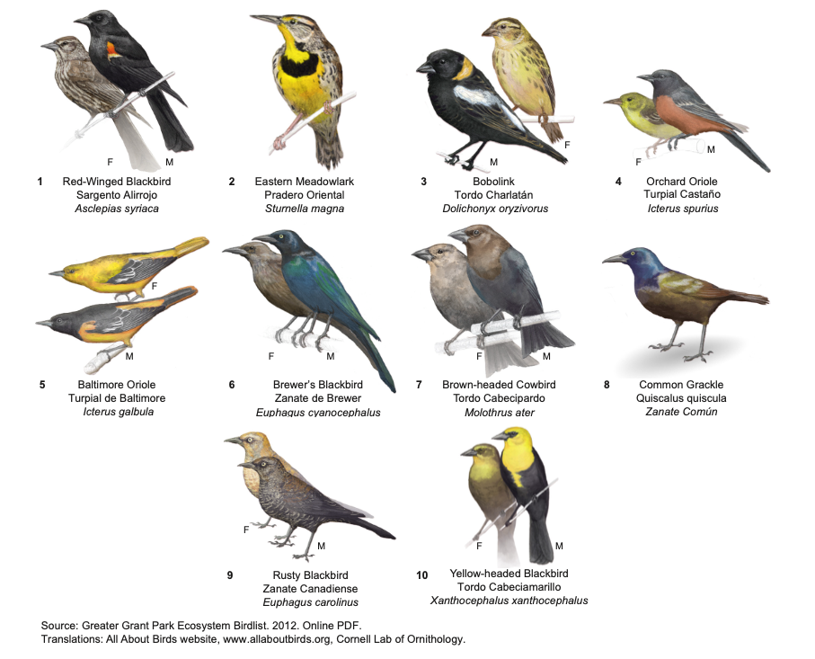
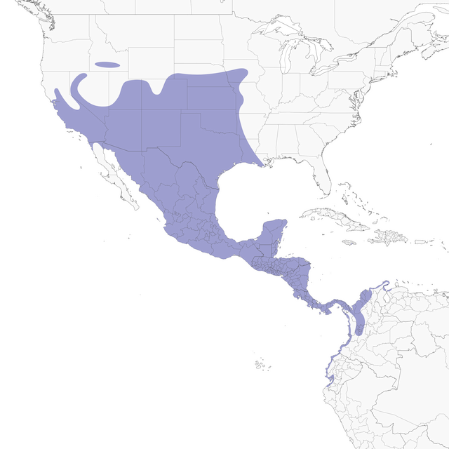
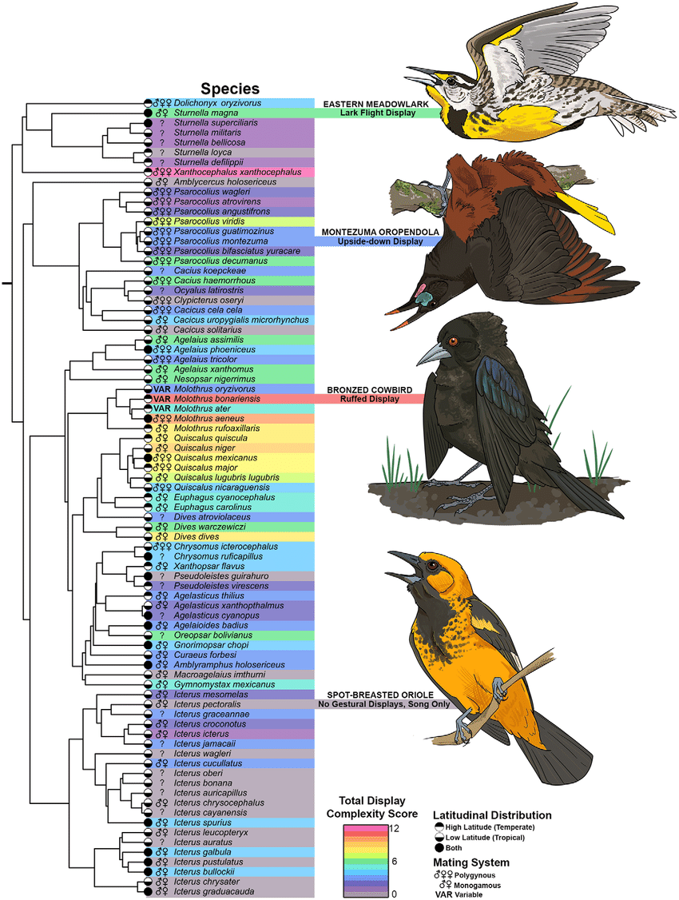
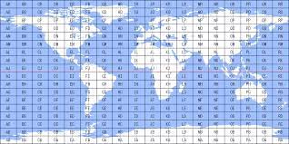

```{r include=FALSE,eval=FALSE}
install.packages(epm)
install.packages(rgdal)
install.packages(sf)
install.packages(caper)
install.packages(geiger)
install.packages(letsR)
install.packages(ggplot2)
install.packages(spdep)
install.packages(spatialreg)
install.packages(rnaturalearth)
install.packages(picante)
```


```{r include=FALSE}
library(epm)
library(rgdal)
library(sf)
library(caper)
library(geiger)
library(letsR)
library(ggplot2)
library(spdep)
library(spatialreg)
library(rnaturalearth)
library(picante)
```

```{r include=FALSE}
world <- ne_countries(scale = "medium", returnclass = "sf")
```

## What is this exercise about?

In this exercise we will assess two macroecological theories using both the *species* and *assemblages* approach.

## Species approach

Testing the relationship between two (or more) attributes that belong to the species, whatever they might be.

Such as:

-   Body size
-   Heat tolerance
-   Home range
-   etc.

## Assemblage approach

Testing the relationship between two (or more) attributes that belong to an assamblage.

Such as:

-   Species richness
-   Climatic conditions
-   Evolutionary history
-   etc.

## Rapoport's rule

What is Rapoport's rule?

What relationship would need to be tested?

## Exercise 1

Here we will test Rapoport's rule in birds of the *Icteridae* family.



## What would we need?

Range size



## What would we need?

Latitudinal position


## What would we need?

Phylogeny



## Data management

We will use 6000 data points for species of the family from the Global Biodiversity Information facility ( *GBIF* )

## Data management

First we will load the data

```{r eval=T,echo=TRUE,include=TRUE}
ict<-read.csv("data/ict.csv",header=T) #load the text file

```

Which will look like this:

```{r eval=T,echo=TRUE,include=TRUE}
head(ict) #show a preview of the table

```

## Data management

Now, it is a pretty common practice to modify data sets depending on the intended use. A common practice is to get rid of data without coordinates (NA) and repeated data:

```{r eval=T,echo=TRUE,include=TRUE}
ict<-na.omit(ict) #remove entries with NA values
ict<-unique(ict) #remove repeated data
names(ict)<-c("taxon","x","y") #renames columns
```

## Data management

An here, we will also modify the species names in the table so they match with the phylogeny

```{r eval=T,echo=TRUE,include=TRUE}
ict$taxon<-gsub(" ","_",ict$taxon)# pattern substitution

```

## Data Management

```{r eval=T,echo=TRUE,include=TRUE}
head(ict)

```

## In a map

```{r eval=T}
ggplot()+
  geom_sf(data=world,fill="#3C3C3C",color="#3C3C3C")+
  geom_point(data=ict,aes(x=x,y=y),color="darkred")+
  theme_void()

```

## Data management

Once the data is clean and ready, wee need some geographic attributes of the species, such as the range size and geographic position.

## The presence-absence matrix

Imagine a checklist

Imagine the world in a grid.

 Each cell would be a place in geography

## The presence-absence matrix

Species can be in multiple cells that have an area


and If we sum them, we get the range size

## The presence-absence matrix

Lets create one

```{r eval=T, echo=T, include=TRUE}
presab<-lets.presab.points(cbind(ict$x,ict$y),ict$taxon,resol = 1)# lets.presab creates a presence absence matrix using coordinates and names
```

## The presence-absence matrix

```{r eval=T, echo=T, include=TRUE}
presab<-lets.presab.points(cbind(ict$x,ict$y),ict$taxon)# lets.presab creates a presence absence matrix using coordinates and names
```

Here, rows will be places, and columns species.

Like a check list showing the presence or absence in each location

## The presence-absence matrix

```{r eval=T, echo=T, include=TRUE}
presab$Presence_and_Absence_Matrix[1:10,1:7]
```

## The presence-absence matrix

What can we do with this matrix?

## The presence-absence matrix

```{r eval=T, echo=T, include=TRUE}
plot(presab)
```

## Range size

If we have this check list of species present in each cell, and the cells have an actual size. How can we use it obtain the range size?

## Range size

letsR has an useful function to obtain the range size that adds all the cells to obtain the area in m2

```{r eval=T,echo=TRUE, include=TRUE}
ranges<-lets.rangesize(presab,units = "squaremeter",coordinates = "planar")
ranges<-ranges/(1000^2)
ict_rap<-data.frame(species=presab$Species_name,range_size=ranges)
head(ict_rap)
```

## Latitudinal mid point

The latitudinal mid point of the species distribution will allow us to determine how far from the equator species truly are

## Latitudinal mid point

If we have the whole distribution and we imagine it as a box


## Latitudinal mid point

```{r eval=T,echo=TRUE, include=TRUE}
midp<-lets.midpoint(presab)
ict_rap<-data.frame(ict_rap,latitude=midp$y)
head(ict_rap)
```

## Rapoport's rule

Now we have the two attributes we want to test, assuming that Rapoport's rule is valid for this family what would we expect?

## Rapoport's rule

We can evaluate it with a simple linear regression

```{r eval=T,echo=TRUE,include=TRUE}
rap_model<-lm(log(Range_size)~abs(latitude),data=ict_rap)
summary(rap_model)

```

## Rapoport's rule

A significant positive relationship. Range size increases outside of equator 0.05 log(Km2) per degree.

## Rapoport's rule

Lets see it

```{r eval=T,echo=TRUE,include=TRUE}
p<-ggplot(ict_rap,aes(abs(latitude),log(Range_size)))+
  geom_point(color="black")+
  xlab("absolute latitude")+
  ylab("Log (Range size)")+
  geom_smooth(method= lm , color="red", fill="#69b3a2", se=TRUE)+
  theme_classic()
```

## Rapoport's rule

```{r eval=T,echo=TRUE,include=TRUE}
plot(p)
```

## Rapoport's rule

But, would this relationship hold up when considering species' relatedness? If so, what is the evolutionary contribution to the relationship?

## Rapoport's rule

To check this, we got to load a phylogenetic tree. In this case we will use an *Icteridae* phylogeny, used in Barker et al., 2015

```{r eval=T,echo=TRUE}
tre<-read.tree("data/Icteridae_tree.txt")
tre
```

## Rapoport's rule

```{r eval=T,echo=TRUE, include=TRUE}
plot(tre,show.tip.label=F)
```

## Rapoport's rule

Now we associate the phylogenetic information to our species attributes, a easy way to do it is creating a *comparative.data* object, which creates a covariance array representing the phylogeny in the dataset

```{r eval=T,echo=TRUE,include=TRUE}
compict<-comparative.data(tre,data=ict_rap,names.col = "species",vcv = T)
compict
```

## Rapoport's rule

Now, we reevaluate the relationship, considering the phylogenetic relatedness using a PGLS (*P*hylogenetic *G*eneralized *L*east *S*quares):

```{r eval=T,echo=TRUE,include=TRUE}
raprule<-pgls(log(Range_size)~abs(latitude),data=compict,lambda="ML")
summary(raprule)
```

## Rapoport's rule

The significant positive relationship is maintained, but both values of the slope and the R2 decreased. why?

## LDG

Now lets try an assemblages based approach by testing the LDG but using Phylogenetic diversity.

## LDG

We already have the assemblages!

```{r eval=T,echo=TRUE,include=TRUE}
plot(presab)
```

## LDG

To make use of them in a more convenient way, we have to transform them:

```{r eval=T,echo=TRUE,include=TRUE}
matx<-data.frame(presab$Presence_and_Absence_Matrix[,-c(1,2)])
head(matx)
```

## LDG

And we have to keep the coordinates:

```{r eval=T,echo=TRUE,include=TRUE}
coords<-presab$Presence_and_Absence_Matrix[,c(1,2)]
head(coords)
```

## LDG

```{r eval=T,echo=TRUE,include=TRUE}
coordsid<-data.frame(x=coords[,1],y=coords[,2],id=1:length(coords[,1]))
head(coordsid)
```

## LDG

How can we calculate species richness?

```{r eval=T,echo=TRUE,include=TRUE}
sr<-rowSums(matx)
ldg<-data.frame(coordsid,sr)
head(ldg)
```

## LDG

Now we can test it

```{r eval=T,echo=TRUE,include=TRUE}
ldgmodel<-lm(sr~abs(y),data=ldg)
summary(ldgmodel)
```

## LDG

Seems that SR is decreasing away from the equator, but R2 values are low

## LDG

what about PD?

## LDG

First we need to be sure both the tree and the PAM match

```{r eval=T,echo=TRUE,include=TRUE}
matchphylo<-match.phylo.comm(tre,matx)
```

## LDG

now we calculate PD

```{r eval=T,echo=TRUE,include=TRUE}
ictpd<-pd(matchphylo$comm,matchphylo$phy)
head(ictpd)
```

## LDG

We join them with the coordinates

```{r eval=T,echo=TRUE,include=TRUE}
pdldg<-data.frame(coordsid,ictpd)
head(pdldg)
```

## LDG

Now we can test it

```{r eval=T,echo=TRUE,include=TRUE}
pdmodel<-lm(PD~abs(y),data=pdldg)
summary(pdmodel)
```

## LDG

lets see it:

```{r eval=T,echo=TRUE,include=TRUE}
p2<-ggplot(pdldg,aes(abs(y),PD))+
  geom_point(color="black")+
  geom_smooth(method= lm , color="red", fill="#69b3a2", se=TRUE) +
  xlab("absolute latitude")+
  theme_classic()
```

## LDG

```{r eval=T,echo=TRUE,include=TRUE}
plot(p2)
```

## LDG

What should we account for?

## LDG

To do so, we have to make spatial the points

```{r eval=T,echo=TRUE,include=TRUE}
pdldg<-na.omit(pdldg)
pdldg.sp<-st_as_sf(pdldg,coords=c("x","y"),crs=st_crs(presab$Richness_Raster))
```

## LDG

create a list of spatial variance/covariance

```{r eval=T,echo=TRUE,include=TRUE}
near<-knearneigh(pdldg.sp,k=8)
nbr<-knn2nb(near)
tw<-nb2listw(nbr)
```

## LDG

Now run the spatially explicit model

```{r eval= TRUE,echo=TRUE,include=TRUE}
spatialmodel<-errorsarlm(formula=PD~abs(y),data=pdldg,listw=tw)
summary(spatialmodel, Nagelkerke=T, Hausman=T)
```
